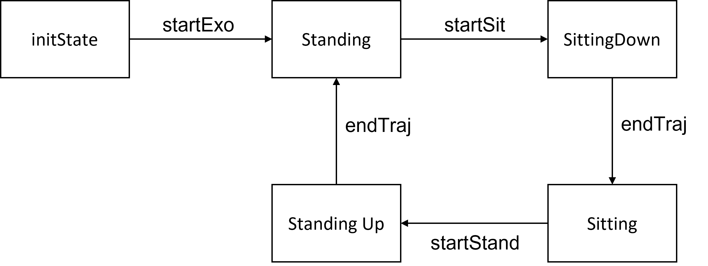

# Basic Simulation - Exoskeleton

The following instructions detail the building and testing of a simple test state machine for the X2 Exoskeleton (ExoTestMachine.cpp). This state machine  simulates a simple exoskeleton which can move between sitting and standing postures, running in position control, triggered by keyboard events. 

At the end of these instructions, you should be to compile and run this example CORC application, verifying that all development tools have been installed correctly. 

## Program Overview 
This example produces a simple state machine with 5 states, representing an exoskeleton which moves between sitting and standing states:



As can be seen in the state diagram, the program begins in the initState, requiring the startExo transition to the standing state (that is, the state representing the exoskeleton in a standing posture). From there, a startSit event is required to transition to the SittingDown state (i.e. a state in which a trajectory representing a sitting down motion is executed), which ends with the EndTraj event and a transition to the Sitting state. From there, a similar startStand event triggers a transition to the StandingUp state, which transitions back to the Standing state with an EndTraj event. 

This example will produce CAN messages on a virtual CANbus, which you can monitor and view. It will also produce text in a terminal window, with keyboard strokes used to navigate between the states. 

## Building ExoTestMachine
CMake is used to generate an appropriate makefile for CORC framework. By default, the generated makefile is configured to compile an executable `ExoTestMachine_APP_NOROBOT` using the default C/C++ compilers. 

### Option 1. Remote Deployment
> **[DEPLOY-REMOTE]** Follow these steps ONLY if you are deploying remotely , otherwise, skip to Option 2.

#### Compiling
To generate a cross-compiled executable (suitable for running on a Beaglebone Black) use the following commands on the host:
```bash
$ mkdir build
$ cd build
$ cmake -DCMAKE_TOOLCHAIN_FILE=../armhf.cmake ..
$ make
```

You can alternatively shorten everything to a single line:
```bash
$ mkdir build && cd build/ && cmake -DCMAKE_TOOLCHAIN_FILE=../armhf.cmake .. && make
```
> Note that this requires an appropriately configured toolchain (`arm-linux-gnueabihf-` toolchain). See Development Machine Setup to setup an appropriate workbench if required.

This build process will take some time to complete (upwards of 3-5 minutes, depending on the speed of your development machine). 

#### Transferring files to the Deployment Machine
If you are deploying to a remote machine, you will need to transfer the compiled executable to the deployment machine. If you are using a BeagleBone, the recommended method of transferring files is FTP.

Using an FTP Client on the Host (if you do not have one - or a preferred client, [FileZilla](https://filezilla-project.org/) is reasonable), connect to the target (the BeagleBone). By default, when the BeagleBone is connected to a computer using USB, it is configured to:

> **IP Address:** 192.168.7.2 (Windows) or 192.168.6.2 (OSX and Linux)
> **Username:** debian
> **Password:** temppwd

On the host, using the FTP client, transfer the build executable in `build/ExoTestMachine_APP_NOROBOT`, along with the contents of the `script` folder, to the Beaglebone.

> Alternatively, you can use the [script/uploadBB.sh](../../script/uploadBB.sh) to automatically upload the content of the script folder and the build/\*APP to the BeagleBone through ssh if you are running Linux as your development machine. 

<!-- Note: The `script` folder contains scripts for setting up the CAN interfaces that CORC uses for communication. If you are using a PEAK CAN USB device, make sure to either use the `initPCAN` script or to manually setup the CAN queue length to 1000 (`ifconfig can0 txqueuelen 1000`).
-->
In addition, copy the `config` folder to the same directory as the executable - this is used to set some parameters in the X2Robot. 

#### Modify Run Permissions
As these files have been transferred to the remote computer, the permissions of any executable must be modified to allow for execution. To do this, we need to run commands on the deployment machine. The easiest way to do this is to SSH into the device. Open your preferred terminal program and SSH into the the BeagleBone. 
```bash
$ ssh debian@192.168.7.2
```
You will be promoted for the user password (`temppwd` by default on a Beaglebone). 

At this point, you will have control of your remote computer through the terminal window.  To change the permissions to allow exeuction, you must do this by navigating to the appropriate file location, and running the `chmod +x` command on the target. e.g.
```bash
$ chmod +x ExoTestMachine_APP_NOROBOT
```
This must be repeated for the `.sh` scripts as well, for this example, `initVCAN.sh`. 

### Option 2. Local Deployment
> **[DEPLOY-LOCAL]** Follow these steps ONLY if you are deploying locally

To compile the code for your local machine, you can take advantage of the default C++ compilers on your Linux distribution. Therefore, the build command is:
```bash
$ mkdir build
$ cd build
$ cmake ..
$ make
```
You can alternatively shorten everything to a single line:
```bash
$ mkdir build && cd build/ && cmake .. && make
```
This build process will take some time to complete (upwards of 3-5 minutes, depending on the speed of your development machine). 

## Executing ExoTestMachine
We are now ready to run the program. To do this, we must open two terminal windows, one which will monitor the data on the CAN device, and one which will execute the code itself. If you are following the **[DEPLOY-REMOTE]** instructions, you will need to open a new SSH session in each terminal window. 

### Initialise Virtual CAN Device
The CORC Application requires the a CAN device to send commands to. For this test, we create a virtual CAN device (so no hardware is required). To do this, initialise the Virtual CAN device to set up, and bind to the VCAN interface using the `initVCAN.sh` script. 

```bash
$  cd script
$  ./initVCAN.sh
```
> Note: This can be changed to use a non-virtual CAN interface, but this requires some minor changes to the code before compilation, and the use of the `initCAN0.sh` script (or `initPCAN.sh` if you use a PEAK CAN USB device) instead. (See other getting started example)

Next, we wish to print the contents of the CAN interface to the terminal window, so that we can monitor the progress of the program. To do this run candump ([candump manpage](https://manpages.debian.org/testing/can-utils/candump.1.en.html)) as follows:
```bash
$  candump vcan0,080~FFF
```
> Note: The `080~FFF` part of the command above filters out all messages with COB-ID of 080. This COB-ID represents a SYNC message which is sent many times a second, which is usually used as a trigger signal by other CAN devices. In this example, there are no other devices to respond, and thus we filter these messages out for clarity. 

### Starting the program 
Open a second terminal window. If you are following the **[DEPLOY-REMOTE]** instructions, SSH into the BeagleBone in a second terminal window. Then navigate to the appropriate folder and run the program as follows:
```bash
$  cd build
$  sudo ./ExoTestMachine_APP_NOROBOT
```
> Note: Superuser privileges (`sudo`) are required due to the use of real time threads in the application.

### Monitoring the program
The first terminal window should display CAN messages on VCAN from the `ExoTestMachine_APP_NOROBOT` application output. On startup init PDO messaging should be sent and appear as follows:
```bash
vcan0 704 [1] 00
vcan0 184 [2] 00 00 # PDO message
vcan0 704 [1] 05
```

In the second terminal window, the ExoTestMachine program will provide status and instructions to work through the program. 
```bash
==================================
 WELCOME TO THE TEST STATE MACHINE
==================================
==================================
 PRESS S to start program
==================================
```

The first terminal instance (running candump) should display PDO messages corresponding to changes to the commanded motor positions as follows:

```bash
vcan0  301   [8]  2F 60 60 00 00 00 00 00
vcan0  302   [8]  80 60 60 00 00 00 00 00
vcan0  303   [8]  2F 60 60 00 00 00 00 00
vcan0  304   [8]  80 60 60 00 00 00 00 00
```

> Note these TPDO messages are configured in the Object Dictionary, with configuration SDOs to be sent during the Robot Initialisation stage. Details for the default set of PDOs can be found in the drive.h source files.

As the simulated device is in position control, these messages should print whenever the system moves from sit to stand or stand to sit, with no messages transmitted whilst the device is stationary (except for the SYNC messages of the format `vcan0 080 [0]`). CORC has provisions for velocity and torque control, but these are not included in this example for ease of simulation.

If these messages are present, this indicates that the workbench and CORC toolbox have been installed successfully. You can close the program by pressing `ctrl+c`.

## Next Steps
Congratulations! You have just run your first CORC program. At this point, if you are interested in writing more complex code in simulation, we recommend you look at the [Custom Application](../3.Software/CustomApplication.md) page. Otherwise, if you wish to try running some examples on hardware that you already have, head back to the [Getting Started](GettingStarted.md) page for other examples, including testing on the Fourier Intelligence ExoMotus X2 or ArmMotus M2 systems. 

<!-- ## Run ExoTestMachine on X2
Running on the X2 Robot is very similar to the virutal CAN set up, with one adjustment and -->
<!-- ### TODO: Event Driven State machine
explain me -->