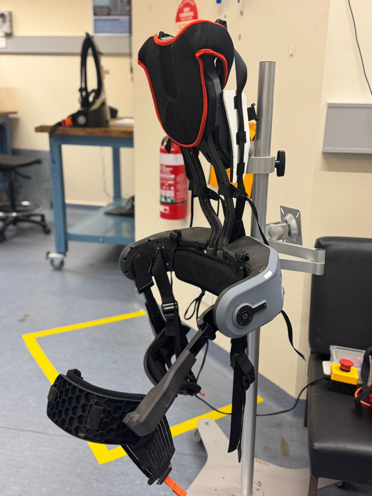
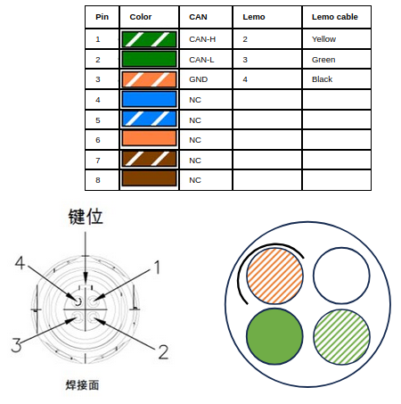

# Hardware Testing - FIT-HV waist exoskeleton

This pages introduces the FITHVDemoMachine, an example CORC app showing the basic use of the FIT-HV waist exoskeleton by ULS Robotics (see manufacturer webpage [here](https://www.ulsrobotics.com/en/h-col-162.html)).

The FIT-HV is a waist/lumbar exoskeleton. It consists of a rigid backpack structure, holding the battery and control electronics, attached via backpack style straps. For each leg, the exoskeleton has one active degree of freedom (DoF) for hip flexion-extension and one passive DoF for the hip abduction-adduction. The exoskeleton is secured at the thigh with semi-rigid cuffs, thus transmitting forces between the upper body and each leg.



FIT-HV exoskeleton on a stand.

The state machine code can be found in the folder `src/apps/FITHVExoDemoMachine`.

It demonstrates the use of:
- The use of FIT-HV exo absolute encoders for calibration
- The use of the torque control of the joints and friction compensation
- The use of the libFLNL comunication library to pusblish the robot state and control state machine transitions (from a Python script).

The state machine and associated FITTHVExo class have been developed and tested for an `FIT-HV CI60DRV` model and behaviours migh differ for different models or systems.

## FIT-HV exo hardware description

### CAN bus and access

The CAN bus of the exoskeleton can be accessed from one of the two Lemo connectors at the top of the backpack. Each connector has four pins, providing CAN bus connection (CAN-H, CAN-L), +36V and a ground (see Figure below). The connectors are from the Lemo FGG-0B-304 series.



CAN and power are also accessible within the pad/controller via JST GH connectors 2 pins (power) and 3 pins(CAN).


### Active joints

The two active joints (hip flexion/extension) of the exoskeleton are controlled by two [Copley Accelnet](https://copleycontrols.com/products/) motor drives with Node IDs 1 and 2. The joints have the following properties:


|Joint property		| Value	|
|-------------------|---------|
|Motor rated torque | 0.570Nm |
|Joint reduction    | 1:46.368 |
|Continuous output torque| 24Nm |
|Encoders counts    | 8000/rev |
|Joint ROM          | 225degrees|


### Absolute encoders

There are absolute encoders as dedicated CAN devices on with Node IDs 3 and 4 that can be read with an SDO request.
Typically using "read 0x9210 0 i16". 0x9210 is a register of integer 16 containing abs encoder value in pulses.
Four bytes response with LSB first. Typically decoded with `pulse=std::stoul(hex[3]+hex[2]+hex[1]+hex[0], 0, 16);`

Example of full CAN exange:
```
CAN_ID=603, Data: 40 10 92 00 00 00 00 00
CAN_ID=583, Data: 43 10 92 00 x0 x1 x2 x3
```


## Running the state machine

To compile and use the FITHVDemoMachine, simply select it in the CMakeLists.txt and set the flags for using a real robot:

```cmake
#include(src/apps/ExoTestMachine/app.cmake)
include(src/apps/FITHVExoDemoMachine/app.cmake)
#include(src/apps/M1DemoMachine/app.cmake)
#include(src/apps/M1DemoMachineROS/app.cmake)

...

# Comment to use actual hardware, uncomment for a nor robot (virtual) app
set(NO_ROBOT OFF)
```

If you intend to cross-compile for a BeagleBone, run: `$ rm -r build && mkdir build && cd build && cmake -DCMAKE_TOOLCHAIN_FILE=../armhf.cmake ..`

otherwise, to run the state machine locally use: `$ rm -r build && mkdir build && cd build && cmake .. `

Then simply compile the state machine: `$ make`

This should create the application `FITHVExoDemoMachine_APP` within the build folder. After initialising the CANbus (using the `initCAN0.sh` or `initCAN1.sh` script) you should be able to run the application, either locally or on the BB (through SSH).

The device will silently calibrate at each start by using the built-in absolute encoders. The other demo states can be accessed using the keyboard keys `0`, `1` and `2` or by sending relevant FLNL command (see code for details).

## FIT-HV exo interface

### Robot model and parameters

The FITT-HV platform use the following parameters, currently fixed and set in `RobotFITHVExo.h` and cannot be loaded dynamically at this point.

```
double dqMax = 400 * M_PI / 180.;                     //!< Max joint speed (rad.s-1). Set to 400deg/s for safety.
double tauMax = 30;                                   //!< Max joint torque (Nm). Set to 30Nm for safety, hardware support higher torque.
std::vector<double> qSigns = {-1., 1.};               //!< Joint direction (as compared to built-in drives direction). Set for extension +
std::vector<double> linkLengths = {0.27, 0.27};       //!< Link lengths used for kinematic models (in m) and mass compensation (i.e. center of mass pos). Distance from hip center to passive joint center.
std::vector<double> massCoeff = {0.0, 0.0};           //!< Mass coefficients (identified) used for gravity compensation (in kg). Equivalent mass at distance linkLengths from hip.
std::vector<double> frictionVis = {0.25, 0.25};       //!< Joint viscous friction compensation coefficients
std::vector<double> frictionCoul = {0.4, 0.4};        //!< Joint Coulomb (static) friction compensation coefficients

std::vector<double> qLimits = { /*q1_min*/ -30 * M_PI / 180., /*q1_max*/ 150 * M_PI / 180.,
								/*q2_min*/ -30 * M_PI / 180., /*q2_max*/ 150 * M_PI / 180. }; //!< Joints limits (in rad)
std::vector<double> qCalibration = {-96*M_PI/180., -76*M_PI/180.};  //!< Calibration configuration: difference between abs encoder reading and expected pose
bool calibrated;
```

### Control methods

The FIT-HV robot only provide simple joint space interaction methods:

 - Obtaining current **joint state** (as for any CORC robot): `robot->getPosition()`, `robot->getVelocity()`, `robot->getTorque()`.
 - **Joint level interaction**: `setJointPosition(V2 q)`, `setJointVelocity(V2 q)` and `setJointTorque(V2 tau)` allow to apply a position, velocity or torque control using an Eigen:vector of length 2. Only Velocity and Torque control modes have been tested.
 - Finally, the method `setJointTorqueWithCompensation(V2 tau)` can be used to apply a torque in addition to the **robot friction compensation**.

See the Doxygen page of the `RobotFITHVExo` class for a full list of available methods.


## Network communication with libFLNL

The FITHVExoDemoMachine app is using libFLNL to publish the robot states and read incoming commands over a TCP/IP connection. Together with the use of an FLNLHelper object (`UIserver = std::make_shared<FLNLHelper>("0.0.0.0");`), the library allows the robot state to be sent at every control loop (`UIserver->sendState();` within the `FITHVExoDemoMachine::hwStateUpdate(void)` method) and send and process incoming commands. The CORC app is here acting as a server on the specified IP (and port, optional, default is 2048) to which client application can connect to.


Note: This FITTHVDemoMachine was designed for and tested on sheep shearing tasks. A description of the system and associated study is available in the following conference publication:
```
@inproceedings{vandenberg2025design,
  title={Design and Evaluation of Assistive Modes in a Lower Back Exoskeleton
for Sheep Shearing: a Case Study},
  author={van den Berg, Jasper and Crocher, Vincent and Tan, Ying and Oetomo, Denny},
  booktitle={Proceedings of the 2025 Australasian Conference on Robotics and Automation, ACRA 2025},
  year={2025}
}
```


