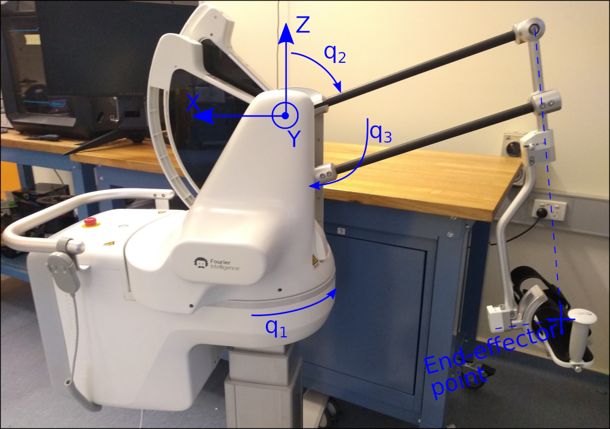

# Hardware Testing - ArmMotus EMU (aka M3) 3D Manipulandum

This pages introduces the M3DemoMachine, an example CORC app showing the basic use of the M3 3D manipulandum.

The M3 is a 3 DoFs impedance based robot developed by Fourier Intelligence:


ArmMotus EMU (aka M3) and reference coordinates.

The state machine code can be found in the folder `src/apps/M3DemoMachine`.

It demonstrates the use of:
- The different control modes of M3 (position, velocity, or impedance)
- The use of the different kinematic models of the robot and associated model parameters (loaded from a YAML file)
- The use of a standard joystick as a control input
- The use of the libFLNL comunication library to pusblish the robot state in a Unity software and send commands to the state machine


## Running the state machine

In the CMakeLists.txt select the M3DemoMachine and set the flags for using a real robot:

```cmake
#include(src/apps/ExoTestMachine/app.cmake)
#include(src/apps/M1DemoMachine/app.cmake)
#include(src/apps/M1DemoMachineROS/app.cmake)
#include(src/apps/M2DemoMachine/app.cmake)
include(src/apps/M3DemoMachine/app.cmake)

...

# Comment to use actual hardware, uncomment for a nor robot (virtual) app
set(NO_ROBOT OFF)
```

If you intend to cross-compile for a BeagleBone (Black or AI), run: `$ rm -r build && mkdir build && cd build && cmake -DCMAKE_TOOLCHAIN_FILE=../armhf.cmake ..`

otherwise, to run the state machine locally use: `$ rm -r build && mkdir build && cd build && cmake .. `

Then simply compile the state machine: `$ make`

This should create the application `M3DemoMachine` within the build folder. After initialising the CANbus (using the `initCAN0.sh` or `initCAN1.sh` script) you should be able to run the application, either locally or on the BB (through SSH).

**WARNING:** With an M3 connected on the CAN bus the robot will imediatly start to move after running the application (to go in a calibration pose), ensure the space is clear around the robot.

Once the calibration state is finished, you can circle through the different demo states using the keyboard (key 1) or using the joystick first button.


## RobotM3 structure and interface

### Robot model and parameters (YAML)

The M3DemoMachine relies on primarily on the RobotM3 class which represents an M3 robot and associated models. Most of the kinematic and some dynamic parameters of the robot are defined within a YAML configuration file and follow the following model:

<!-- language: lang-none -->
                                  /\
                                /-  \
                              /-     \
                            /-        \
                  (L4)    /-           \
                        /-  \           \
                      /-     \           \
                     /        \           \ (L2)
                   /-          \           \
               M3/-             \        M1 \
               /-                \           \
             /-                   \           \
           /-                   M2 \           \
         /-                         \           \
    +------+                         \           \
    | MTool|                          \           \
    +------+                           \         q1-  (L0)
                                        \          -------
                                         \    (L1)      q0
                                        q2              |
                                                        |
                                                        |
                                                        |


Extract from the YAML configuration file (`config/M3_params.yaml`) used to specify the robot parameters:
```yaml
EMU_FOURIER:
  dqMax: 360 # Max joint speed (deg.s-1) Set to 1 rot/s
  tauMax: 42 # Max joint torque (Nm) Set to max motor torque w/ 1:22 reduction (yes, this is the actual value!)
  qSigns: [-1, 1, -1] # Joints direction

  linkLengths: [0.056, 0.135, 0.5, 0.615]   # Link lengths used for kinematic models (in m), excluding tool
  linkMasses: [0, 0.450, 0.400, 0.100, .270] # Link masses used for gravity compensation (in kg), excluding tool

  qLimits: [-43, 43, -15, 70, 0, 95] # Joints limits (in deg) {q1_min, q1_max, q2_min, q2_max, q3_min, q3_max}
  qCalibration: [+44, 76, 90] # Calibration configuration (in deg): posture in which the robot is when using the calibration procedure

  frictionVis: [0.2, 0.2, 0.2]  # Joint viscous friction compensation coefficients
  frictionCoul: [0., 0., 0.] # Joint Coulomb (static) friction compensation coefficients

  #End-effector description
  tool:
    name: "Fourier Handle"
    length: 0.0 #Tool length from attachment
    mass:   0.345  #Tool mass in kg
```

The YAML configuration file to use and the corresponding robot name (model) can be selected from the RobotM3 constructor parameters: `RobotM3(std::string robot_name="", std::string yaml_config_file="")`.

### Control methods

The CORC M3 robot model has the following specific methods of interaction:
- Obtaining current **joint state** (as for any CORC robot): `robot->getPosition()`, `robot->getVelocity()`, `robot->getTorque()`.
- **Joint level interaction**: `setJointPosition(VM3 q)`, `setJointVelocity(VM3 q)` and `setJointTorque(VM3 tau)` allow to apply a position, velocity or torque control using an Eigen:vector of length 3. An example of the torque control can be found in the `M3CalibState` state. Note the  use of `robot->initTorqueControl();` in the `entryCode()` method before applying torque control.
- Obtaining current **end-effector state**: `robot->getEndEffPosition()`, `robot->getEndEffVelocity()`, `robot->getEndEffForce()`. Methods are also provided to obtain the filtered velocity and acceleration (obtained through differentiation and low-pass filtering). Additionally the pure interaction force at the end-effector, calculated using the robot model and motor torques from wich gravity compensation torques are subtracted can be obtained using the `robot->getInteractionForce()` method.
- **End-effector space control** is available using: `setEndEffPosition(VM3 X)`, `setEndEffVelocity(VM3 dX)`, `setEndEffForce(VM3 F)`. These methods rely on the `inverseKinematic()` and robot Jacobian `J()` and assumes that the kinematic parameters loaded from the YAML file are correct and that the robot has been calibrated (see `applyCalibration()`). As for their joints counterparts, they require the proper use of the corresponding initTorque/Velocity/Position method beforehand. The command vectors are expressed in the robot base frame as shown on the picture above. An example of the use of the end-effector velocity control is available in the `M3EndEffDemo` state.
- Finally, the method `setEndEffForceWithCompensation(VM3 F, bool friction_comp=true)` can be used to apply an end-effector force in addition to the **robot gravity self-compensation and friction compensation (optional)**. This method relies on the robot model and parameters (masses and friction coefficients) set in the YAML configuration file. The friction compensation uses a Coulomb + viscous friction model.

See the Doxygen page of the `RobotM3` class for a full list of available methods.

## Joystick

The `RobotM3` class includes a Joystick input by default. The joystick, if connected, can be used within the different state machine states and transitions.

An example of the use of the first stick of a joystick used as an input can be found in the `M3EndEffDemo` state. The method `robot->joystick->getAxis(i)` returns a value proportional to the position of the stick direction `i`, which is used as a velocity command.

Additionally, joystick buttons are used in the state machine transition: `M3DemoMachine::GoToNextState` to allow transition by a button press: `OWNER->robot->joystick->isButtonTransition(3)`. Note the use of the ButtonTransition method to avoid capturing repeatedly if the button stays pressed.


## Network communication with libFLNL

The M3DemoMachine app is using libFLNL to publish the robot states and read incoming commands over a TCP/IP connection. Together with the use of an FLNLHelper object (`UIserver = new FLNLHelper(robot, "192.168.6.2");`), the library allows the robot state to be sent at every control loop (`UIserver->sendState();` within the `M3DemoMachine::hwStateUpdate(void)` method) and send and process incoming commands. The CORC app is here acting as a server on the specified IP (and port, optional, default is 2048) to which client application can connect to.


An example class to process incoming states and send/receive commands from a Unity or Matlab script (client side) can be found [here](https://github.com/UniMelbHumanRoboticsLab/CORC-UI-Demo). 

