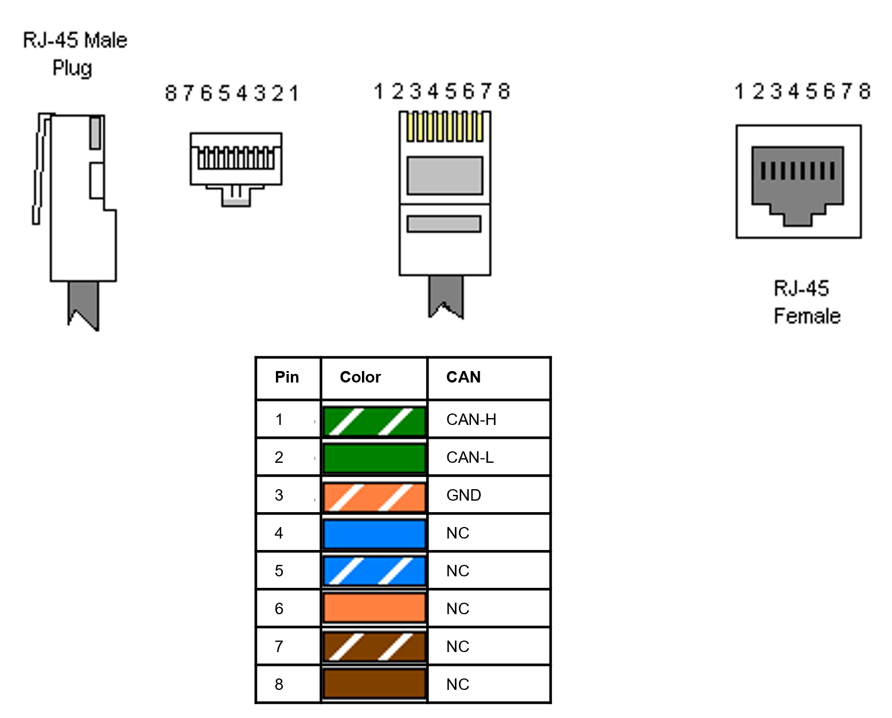

# Using BeagleBones

If you want to run CORC on a Single Board Controller (SBC), Beagle Bone Black (BBB) are a good efficient choice. CORC has been well tested on a BeagleBone Black running Debian Stretch 9.5 [Firmware](http://beagleboard.org/latest-images). Instructions for setting up the Beaglebone Black can be found on [here](http://beagleboard.org/getting-started) on the Beaglebone Website.

You will need a BBB and a cape providing a CAN interface such as the [Comms cape](https://www.beagleboard.org/boards/beaglebone-comms-cape) or the [RS485 CAN cape](https://www.waveshare.com/rs485-can-cape.htm), both tested. 

The CAN physical connection (RJ45 ports) follows the CiA 303-1 standard, specifically: 



Only CAN-L, CAN-H and CAN GND lines are necessary and are to be connected to the BB cape. You need to connect those from the internal CAN bus of your machine (see also [here](./ModifyingDevice.md)).

## Setting up a BeagleBone
 
 Once you have a Beagle Bone ready to use and connected you can: 
 
 - Setup ssh key and share it to avoid password use: `ssh-copy-id debian@192.168.7.2` . In case of issue because of an existing, different, BB setup: `ssh-keyscan -H 192.168.7.2 >> ~/.ssh/known_hosts` (the default password of the `debian` user of the Debian image is `temppwd`)
 - Getting cross-compiler ready on your dev. machine: `sudo apt install g++-arm-linux-gnueabihf`

## Compiling and running CORC

CORC should run natively on the default Debian image of the Beagle Bone, simply cross-compile your CORC application by using the appropriate flag in your cmake command:
```
$ cmake -DCMAKE_TOOLCHAIN_FILE=../armhf.cmake ..
```
 then build: 
 ```
$ make
 ```
Finally you can use the provided script to copy the resulting app (but also the necessary config files) to the Beagle Bone:
```
$ ../script/uploadBB.sh
```

To test your app, ssh to the Beagle Bone
```
$ ssh debian@192.168.7.2
```
navigate to the CANOpencRobotController folder and run your app as on a local machine. You may need to first initialise either a virtual or real CAN bus using the provided scripts (`script/initVCAN.sh` or `script/initCAN1.sh` for a Beagle Bone Black).


## Setting up CAN device on a BeagleBone AI

As opposed to the BB Black, the BeagleBone AI doesn't natively expose its can device. To do so an update of the Device Tree Source (DTS) is required.

### Instructions

#### Short version using binary (compiled) DTB file
1. Download the updated [DTB file](am5729-beagleboneai-custom-can.dtb)
2. Copy it into the '/boot/dtbs' folder of your BB AI: `/boot/dtbs/am5729-beagleboneai-custom-can.dtb`
3. On the BB AI edit the uEnv file: `$ sudo editor /boot/uEnv.txt` and add the line: `dtb=am5729-beagleboneai-custom-can.dtb`. Save the file (ctrl+x).
4. Reboot the BB AI (`$ sudo reboot`).
5. Test: `$ ip link`


#### Longer version using DTS file
See [StackOverflow post](https://stackoverflow.com/questions/62207737/beaglebone-ai-how-to-setup-can-bus).


#### Note 
This will expose the CAN port of pins P9_24 and P9_26 as CAN0 device as opposed to the BeagleBone Black where it corresponds to CAN1 device. To use it you should thus either use the initCAN0.sh script or manually configure the can0 port:

```bash
$ sudo ip link set can0 up type can bitrate 1000000
$ sudo ifconfig can0 up
```
