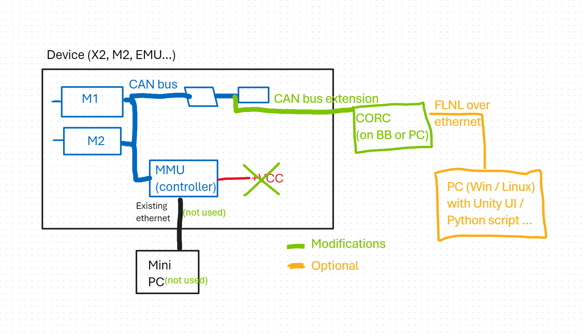

# Modifying your device

By using CORC your are replacing the controller (both hadware and software) of your device to get full control on it. This thus involve some hardware modification such that the CORC controller (either a PC with USB-CAN or an SBC) get access to the internal CAN bus of the robot:

Schematic of required hardware modifications.

In a nutshell, you will need to:
 
1. Open your device to access the electronics;
2. Find an accessible CAN port to connect an RJ45 (ethernet) cable (either on a distributiuon board, a motor drive or another CAN peripheral with a spare RJ45 CAN port);
3. Run this cable outside, either adding or using a panel connector or just an accessible space;
4. Disconnect temporarilly the internal existing device controller: you do not want CORC to fight with the existing controller for the control of the device over the CAN bus;
5. Test CORC carefully, ensuring your Estop are functional and everything is safe;
6. Close the device.

## A great power...

... you know the drill. 

CORC allows you to entirely replace the controller of your machine and modify it the way you want. This potentially involves removing all safety and limits and create new risks. You should be aware of those risks (for your users, for yourself and for the device itself) and manage them appropriately. Process carefully following good practices.