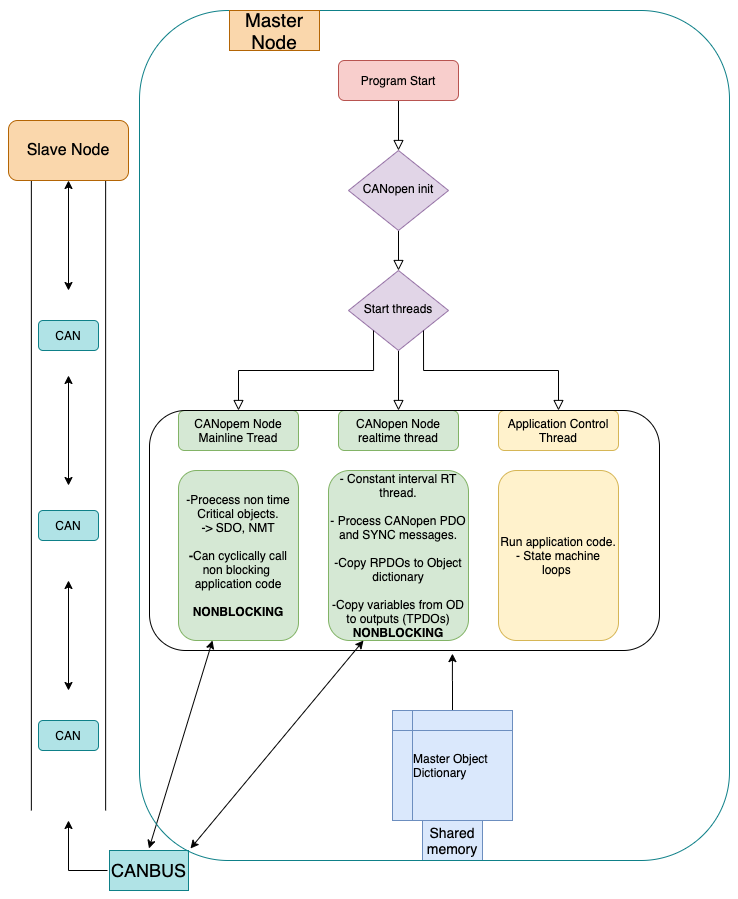

# Multi-threaded execution

To run application tasks and network tasks (all CANopen activity and messaging) the software runs three parallel threads. Two threads to maintain up to date CANopen processes and a third running the applications program loop. A flowchart of a typical CORC implementation can be found below.

## CANopenNode threads

Using the CANopenNode framework, CORC runs both a mainline thread for executing time-consuming CANopen operations (SDO messaging, Heartbeat, LSS, etc.) and a "realtime" thread for time-critical CANopen operations (PDO and SYNC messaging), running at a constant interval (typically 1ms).

For more details on the implementation of CANopenNode please go to the projects GitHub and documentation [page](https://github.com/CANopenNode/CANopenNode).

# Application thread

The application loop speed can be altered by the developper, however, it must run slower than the CANopen Node rt loop. This ensures any PDO reliant commands to nodes from the application are processed and sent out on the bus.

These values are set in `core\application.h`:
```
const float controlLoopPeriodInms = 2.;   //!< Define the control loop period (in ms): the period of rt_control_thread loop (and so the app update rate). In ms.
const float CANUpdateLoopPeriodInms = 1.; //!< Define the CAN PDO processing period. SYNCH messages (and so actual PDO update) is set to twice this period (twice slower). In ms.
```
It is the responsability of the developper to ensure that the execution of its states (`during()`, `entry()` and `exit()` methods) can be executed during that time interval. A warning message is issued when a time overflow occurs.


# Flowchart of a typical CORC implementation


